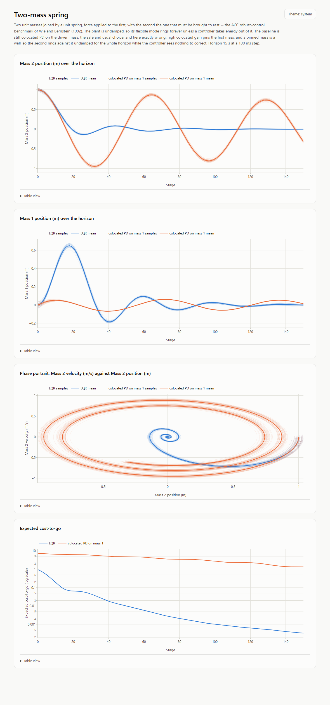

# fbsde_traj_opt

Trajectory optimization via forward-backward stochastic differential equations (FBSDEs).

This is a research library for algorithms that rapidly produce closed-loop optimal trajectory
controllers for cost functions that are defined arbitrarily and encountered online. The approach
rests on the connection between FBSDEs and stochastic optimal control problems established by the
Feynman-Kac equations, which turns the value function of a control problem into the solution of a
backward SDE that can be estimated by forward sampling.

The methods implemented here follow the thesis below, in particular the discrete-time FBSDE
estimators (DT-FBSDE) and Forward-Backward RRT (FBRRT).

## Reference

Kelsey P. Hawkins, *Feynman-Kac Numerical Techniques for Stochastic Optimal Control*,
Ph.D. thesis, Georgia Institute of Technology, 2021.
<https://repository.gatech.edu/entities/publication/0011748b-4460-4292-b861-eca1a976eb0e>

## Status

Early development. The public API is unstable.

## What is here

The library is built out of small functor types -- drift, diffusion, cost, policy -- that are
composed into models, with concepts rather than base classes stating what each one has to provide.
Everything is fixed-size at compile time and allocates nothing on the sampling path.

- **Forward SDE models.** A discrete-time, control-affine SDE assembled from an uncontrolled
  drift, a control drift matrix, and a diffusion term.
- **Trajectory batches.** `TrajectoryBatch` samples a fixed number of closed-loop rollouts over a
  fixed horizon and answers cross-sectional questions about them -- the state distribution at a
  stage, its mean, and the expected cost-to-go from every stage.
- **Reproducible noise.** The noise comes from a stateless, coordinate-addressed sampler, so two
  batches with the same seed and shape see exactly the same random numbers even if their
  dynamics, cost, or policy differ. That is what makes two batches comparable: a difference
  between them is a difference between the things that changed.
- **Finite-horizon LQR.** `SolveFiniteHorizonLqr` runs the backward Riccati recursion over a
  linear model and a quadratic cost and returns the optimal stage-varying feedback policy, ready
  to be handed straight back to the sampler. `SolveFiniteHorizonLqrWithCostToGo` also returns the
  cost-to-go Hessian at every stage, which makes an LQR problem a ground truth an estimator can be
  checked against rather than only compared with.
- **Value function approximation.** A value function at one stage is anything that can report its
  value, its state gradient, and its state Hessian -- stated as a concept, so models can be
  swapped without touching the algorithms that use them. `SoftMinQuadraticValueFunctionApprox` is
  the first: a smooth minimum over several convex quadratics, exact on the LQR case and able to
  represent a multi-basin landscape. Every evaluation is batched over a compile-time number of
  samples held one per column.
- **Backward-step estimation.** `TaylorNoiselessBackwardStepEstimator` implements the off-policy
  drifted Taylor noiseless estimator of the thesis: given a state, the drift the forward pass used
  to leave it, and the next stage's value function, it estimates this stage's. It depends on no
  noise realization, so its targets are fixed labels; and where the true value function is
  quadratic it is exact.
- **Fitting.** `ValueFunctionSgdFitter` drives a value function toward those targets by minibatch
  Adam, damped so the representation improves without lurching -- principally by a trust region on
  the change the step makes to the function's own values, which means the same thing for every
  model.
- **Polynomial value functions.** `PolynomialValueFunctionApprox` is the least-squares Monte Carlo
  model of the thesis: every monomial up to a fixed degree in a state normalized over a fixed
  region of interest, fitted in closed form by weighted least squares. The fixed normalization is
  what lets two fitted models be blended coefficient by coefficient.
- **Policy improvement.** `TaylorQFunctionL1Policy` is the Section 4.4 policy: the control that
  minimizes the Taylor Q-function -- the next stage's value function where the step actually lands,
  plus the noise's curvature correction -- for an L1 running cost and a box-bounded control, whose
  minimizers are bang-off-bang.
- **The iterative method.** `DtFbsdeIterativeSolver` is the DT-FBSDE iterative method of Section
  4.6: sample parallel trajectories, fit a value function at every stage by a backward pass,
  improve the policy through the Q-function, resample. It explores with the thesis's `{-1, 0, 1}`
  controls, fits one-step probe branches alongside the paths, and damps every update by a line
  search checked on rollouts; its header explains each choice and what goes wrong without it.
- **Visualization.** `//fbsde_traj_opt/viz` turns a batch into Plotly figures and writes them as a
  self-contained HTML page, which the example binary opens for you. Figures can be lines, heatmaps
  over a grid, or animated over a sequence of frames, with the axis or color range pinned across
  the whole sequence so that what moves on screen is the data and not the scale. An animation can
  move points in both coordinates, which is how a mechanism is drawn moving in the plane.

## Worked examples

```sh
bazel run //examples:lqr_experiments
```

This solves three LQR problems from the control literature, rolls out both the optimal policy and
a plausible fixed-gain baseline over identical noise, and writes one HTML report per model to open
in your browser. Each report shows the sampled state distributions with the mean trajectory
over them, a phase portrait, and the expected cost-to-go of both policies.

[](docs/screenshots/)

The models are the double integrator, the inverted pendulum on a cart, and the Wie-Bernstein
two-mass spring benchmark; the baselines cost between 7 and 36 times what the optimal policy does.
See [docs/screenshots](docs/screenshots/) for each one and for why its baseline fails.

Pass `--output-dir` to put the reports somewhere other than `lqr_reports/`, and `--seed` to change
the noise both policies share.

```sh
bazel run //examples:value_function_fitting_experiments
```

This runs the value function approximation suite and writes three more reports. The first fits the
soft-minimum model to a one-dimensional target that is nowhere a quadratic, and charts the
approach along with how often the trust region shortened a step. The second sweeps the Taylor
Noiseless estimator backward over an LQR problem, whose value function is known in closed form, and
takes the error apart into the estimator's own -- which comes out at the level of rounding -- and
the regression's. The third fits a two-dimensional target and draws the target, the approximation,
and the signed error as heatmaps over the state plane.

Each report opens on an animation, because the thing being claimed in all three is a change over
time and a still picture is the wrong medium for it. Press play to watch the approximation walk
onto the one-dimensional target, the backward recursion march from the terminal stage to stage 0
with the fitted curve tracking the exact one, and the error drain out of the state plane. Every
animation rests on its last frame, so a reader who never presses play -- or who is reading a
printout, or the table under the figure -- sees the result rather than the starting guess.

It takes the same `--output-dir` and `--seed` flags.

```sh
bazel run -c opt //examples:double_inverted_pendulum
```

This swings up the L1 double inverted pendulum of the thesis's Section 5.5.3 -- two links, a
torque motor at the base only, starting from hanging at rest, with the minimum-fuel objective
`c0 |u|` plus a quadratic terminal cost at inverted -- using the DT-FBSDE iterative method rather
than the thesis's FBRRT. It runs for about ten minutes on eight cores; build it optimized.

The report opens on an animation of the two links swinging up. The next figures show how the
method got there: the expected cost over the iterations -- measured on evaluation rollouts, and as
the stage-0 value function predicts it -- and the policy at every iteration, on a slider: its
noise-free rollout from hanging, the policy over time and the first link's angle around that
rollout, and every iteration's control in one heatmap. The figures after those check that the
simulation is right: every step of the discrete model against a 64-substep Runge-Kutta reference,
energy conservation of the frictionless pendulum, and the order of convergence of the step. The
last group asks whether the L1 cost was actually minimized: the control signal, how often it sits
at -1, 0 or +1 (an L1-optimal control is bang-off-bang), the fuel spent against a saturated
control, and the policy itself as a map over the state.

With the default seed, after 150 iterations the policy's mean cost on fresh rollouts is 3.50 --
1.99 of fuel and 1.51 of terminal cost -- and 93% of rollouts end with both links within 20
degrees of inverted. For scale, the best noise-free open-loop control sequence found by direct
optimization costs 1.97 on the same discrete model, with 1.87 of fuel: the method spends about the
same fuel as the optimum and gives up the rest in the precision of the final approach, arriving on
average about 15 degrees short of vertical and still rising. Holding full torque for the whole
horizon would cost 2.5 in fuel alone.

The pendulum is two uniform 1 kg, 0.5 m links with a 5 N m motor. The thesis does not give its
parameters; these were chosen so that a swing-up within the 2.5 s horizon is possible but needs
most of the torque available. The equations of motion are rederived from the Lagrangian in the
thesis's constants: equation (5.20) as printed there puts the two links' gravity terms at opposite
signs and omits a term from the off-diagonal inertia, and
[the model header](examples/double_inverted_pendulum_model.hpp) says exactly how. The step is a
zero-order hold integrated by RK4 and written in control-affine form; its one-step error against a
64-substep reference is under 2e-4 rad in the angles, and the frictionless pendulum keeps its
energy to 6e-7 of scale over the horizon.

It takes `--output-dir`, `--seed`, and `--iterations`.

## Prerequisites

- [Bazelisk](https://github.com/bazelbuild/bazelisk) (it reads `.bazelversion` and fetches the
  matching Bazel release)
- Clang with C++23 support, including `<expected>`
- [pre-commit](https://pre-commit.com/), for contributors

Dependencies -- Eigen, nlohmann/json, and GoogleTest -- are fetched by Bazel from the Bazel
Central Registry; there is nothing to install by hand.

## Build and test

```sh
bazel build //...
bazel test //...
```

## Contributing

Install the hooks once after cloning:

```sh
pre-commit install
```

Formatting is `clang-format` (Google style, 2-space indent, 120 columns, west-const) and static
analysis is `clang-tidy`; both are enforced on commit.

## License

MIT. See [LICENSE](LICENSE).
